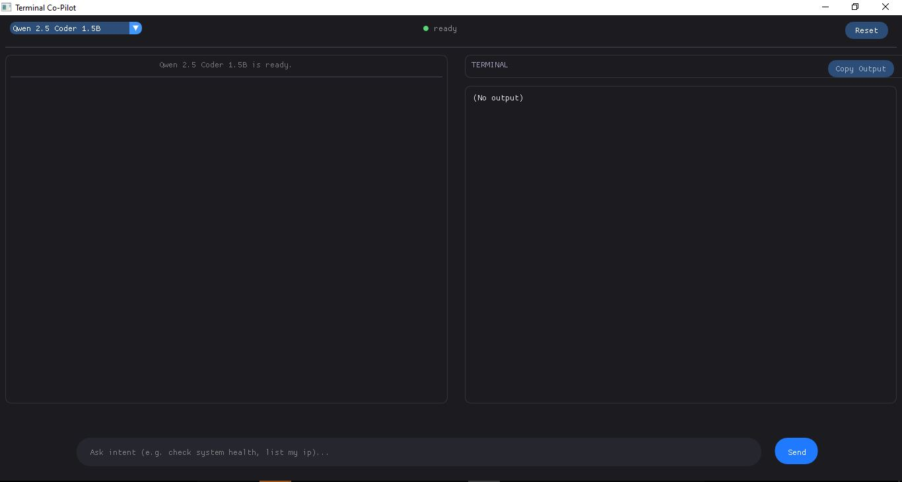
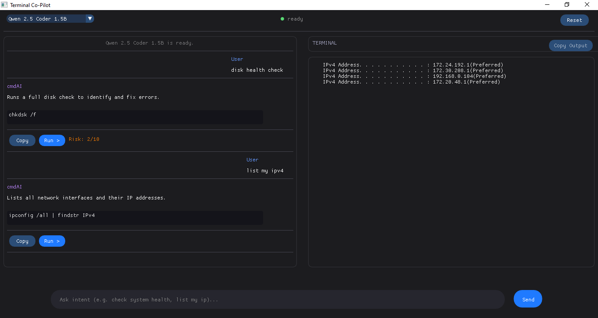
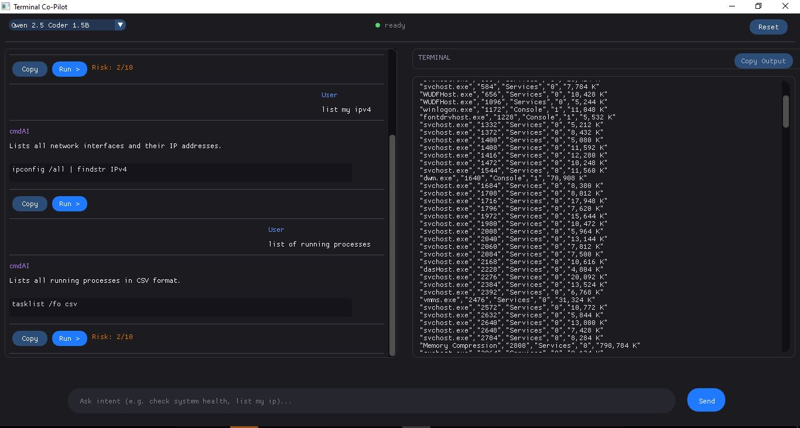

# 🚀 Terminal Co-Pilot (cmdAI)

A local-first Windows CLI orchestrator that translates natural language into terminal commands using local LLMs. 🛠️

---

## 📸 Showcase

| Main Dashboard | cmdAI in action  |  Model Selector  |
| :---: | :---: | :---: |
|  |  |  |

---


## ✨ Features

- **🌐 Local Inference**: Powered by `llama.cpp` for GGUF models (Qwen 2.5, Phi-3.5).
- **🛡️ Security**: Built-in command firewall to prevent malicious execution.
- **🐚 Smart Shell**: Automatically detects and routes between CMD and PowerShell.
- **🎨 Modern UI**: Clean, responsive ImGui interface with real-time process control.
- **⌨️ Global Access**: Instant show/hide via system-wide hotkey (`ALT + I`).

---

## 🚀 Try it Now (No Setup)

Don't want to build from source? 
1. Go to the **[Releases](https://github.com/ImJarvis/Terminal-Co-Pilot/releases)** page.
2. Download the latest `Terminal Co-Pilot.zip`.
3. Extract and run `cmdAI.exe`.

*📦 Size: ~20MB (Executables ONLY) or ~370MB (With 0.5B Model).*

---

## 📋 Prerequisites

- **💻 Visual Studio 2022** (C++ workload)
- **⚙️ CMake 3.20+**
- **🐙 Git**

## 🏗️ Installation & Build

1. **📥 Clone**:
   ```bash
   git clone https://github.com/ImJarvis/Terminal-Co-Pilot.git
   cd cmdAI
   git submodule update --init --recursive
   ```

2. **🛠️ Build**:
   ```bash
   mkdir build && cd build
   cmake ..
   cmake --build . --config Release
   ```
   *💡 Note: Models will be downloaded automatically on the first run.*

## 🎮 Usage

- **🔔 Summon**: Press `ALT + I` to show/hide the app.
- **💬 Prompt**: Type your intent in the bottom command bar (e.g., "show me systme info or list large files").
- **▶️ Execute**: Press `Enter` or click the `>` button to run the generated command.
- **⏹️ Stop**: Use the pulsing `Stop` button to terminate running processes.
- **🧹 Reset**: Click `Reset` in the top-right to clear session context.

---

## 📄 License

This project is licensed under the MIT License.

